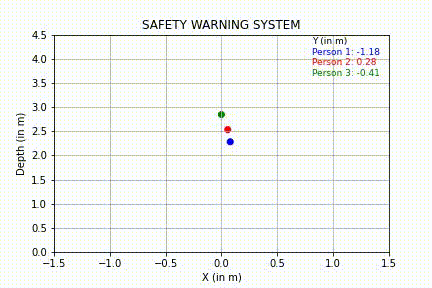

# Object Tracking for Safety - Team SafeBots

[EECS 504] Final Project - Saptadeep Debnath, Preeti Kannapan, Malvika Shetty

The aim of our project is to implement object tracking in videos using bounded boxes for safety applications. With more and more autonomous robots and vehicles being deployed in the world, it is becoming increasingly important to ensure the safety of everyone in the robot’s environment. There are many contexts in which this is applicable:
- human-robot interactions e.g. collaborative robots 
- robot-robot interactions e.g. industrial robots 
- robot-object interactions e.g. in manipulation or obstacle avoidance tasks. 

Specifically, we would like to use object tracking to detect and draw conclusions about the distance of the moving object from the camera, and additionally issue a warning based on the proximity of the object to the camera. Such a warning would be useful for a robot, vehicle, or even human, to react appropriately when the camera is mounted on them. This will be done with a depth estimator method that makes use of the variation in scale of the bounding box with depth of the object. Therefore, we propose to implement object tracking as well as a proximity warning system for safety purposes.

## Goals
The video submission includes;
- the methodology used to implement object detection and tracking,
- a comparative study of the implemented method with other state-of-the-art techniques, 
- the methodology used to implement the proximity warning system with depth estimation, and
- a live visualization of the integrated system performing object tracking and proximity warning on a video.


## Running the code

1. First, clone or download this GitHub repository. Install requirements and download pretrained weights:

```
pip install -r ./requirements.txt
wget -P model_data https://pjreddie.com/media/files/yolov3.weights
```

2. Start with using pretrained weights to test predictions on both image and video:

- `python detection_demo.py`
- `python object_tracking.py`

<p align="center">
    
</p>


## Results

Download the [Princeton tracking benchmark](https://tracking.cs.princeton.edu/dataset.html) dataset and run the [Final_SafetyWarningSystem.ipynb](https://github.com/eecs504-f20/object-tracking-for-safety/blob/master/Final_SafetyWarningSystem.ipynb)

<p align="center">
    
</p>
<p align="center">
    
</p>
<p align="center">
    
</p>

<!--  -->


Check the [proposal](https://github.com/eecs504-f20/object-tracking-for-safety/blob/master/EECS504_Proposal.pdf), [final report](https://github.com/eecs504-f20/object-tracking-for-safety/blob/master/EECS504_SafeBot_Report.pdf) and [video presentation](https://youtu.be/aILSsw7K2z8) for more details on implementation. 


## Team Members
- [Saptadeep Debnath](https://www.linkedin.com/in/saptadeep-deb/) (saptadeb@umich.edu)
- [Preeti Kannapan](https://www.linkedin.com/in/preeti-kannapan-646663170) (preetimk@umich.edu)
- [Malvika Shetty](https://www.linkedin.com/in/malvikadshetty) (malvikad@umich.edu)
